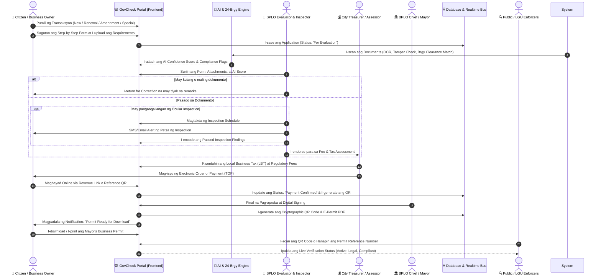
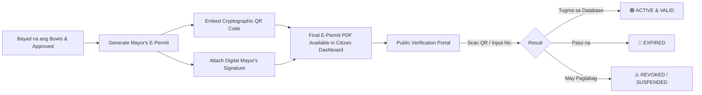

# GovCheck - Business Permit & Licensing System (BPLS)
## End-to-End System Workflow, Roles, & Technical Process Guide

---

## 📑 Talaan ng Nilalaman
1. [System Overview & Objectives](#1-system-overview--objectives)
2. [User Roles & Permissions Matrix](#2-user-roles--permissions-matrix)
3. [Master Process Workflow (Mermaid Diagram)](#3-master-process-workflow-mermaid-diagram)
4. [Step-by-Step Core Business Permit Processes](#4-step-by-step-core-business-permit-processes)
   - [4.1 Bagong Aplikasyon (New Business Permit Application)](#41-bagong-aplikasyon-new-business-permit-application)
   - [4.2 Pag-renew ng Permiso (Business Permit Renewal)](#42-pag-renew-ng-permiso-business-permit-renewal)
   - [4.3 Pagbabago ng Permiso (Business Permit Amendment)](#43-pagbabago-ng-permiso-business-permit-amendment)
   - [4.4 Special / Short-Term Permit](#44-special--short-term-permit)
   - [4.5 Certified True Copies (CTC) Pulling / Request](#45-certified-true-copies-ctc-pulling--request)
5. [Specialized Sub-Modules & Certifications](#5-specialized-sub-modules--certifications)
   - [5.1 QC SAFE Seal Certification Flow](#51-qc-safe-seal-certification-flow)
   - [5.2 24-Barangay Network Clearance Cross-Check](#52-24-barangay-network-clearance-cross-check)
6. [AI Automation & Compliance Layer](#6-ai-automation--compliance-layer)
7. [Assessment, Local Tax Computation & Payment Flow](#7-assessment-local-tax-computation--payment-flow)
8. [Permit Issuance, Cryptographic QR Code & Public Verification](#8-permit-issuance-cryptographic-qr-code--public-verification)
9. [Application Lifecycle Status States](#9-application-lifecycle-status-states)

---

## 1. System Overview & Objectives

Ang **Business Permit and Licensing Module** ng GovCheck ay isang sentralisadong online portal para sa LGU (Local Government Unit) Business Permit and Licensing Office (BPLO). Layunin nitong gawing 100% digital, paperless, at anti-fixer ang buong lifecycle ng business permits mula sa pag-apply, AI evaluation, tax assessment, online payment, hanggang sa cryptographic verification.

---

## 2. User Roles & Permissions Matrix

Nasa ibaba ang mga tiyak na gampanin (roles) at kanilang access permissions sa loob ng Business Permit and Licensing Module:

| Role | Deskripsyon / Responsibilidad | Mga Module at Aksyon na May Access |
| :--- | :--- | :--- |
| **1. Citizen / Business Applicant / Owner** | May-ari ng negosyo o awtorisadong kinatawan na nag-aaplay at nagbabayad ng permit. | • Mag-apply (New, Renewal, Amendment, Special Permit)<br/>• Mag-upload ng mga dokumento & ID<br/>• Subaybayan ang Application Status (Real-time Tracker)<br/>• Magbayad ng Business Tax & Fees via Revenue QR/Link<br/>• Mag-download/Print ng E-Permit at CTC<br/>• Mag-apply para sa QC SAFE Seal |
| **2. BPLO Evaluator / Receiving Officer** | Kawani ng LGU na sumusuri sa completeness at legal compliance ng mga dokumento. | • Intelligent Approval Dashboard (Review Queue)<br/>• AI OCR Document Matcher & Fraud Detection Viewer<br/>• Mag-approve para sa assessment o mag-return for correction (with remarks)<br/>• Mag-endorse para sa inspection kung high-risk |
| **3. LGU Field Inspector (Sanitary / Fire / Zoning)** | Inspector na nagpapatunay ng pisikal na pagsunod ng pwesto ng negosyo. | • Inspection Scheduling Module<br/>• Ocular Inspection Checklist & Photo Findings Upload<br/>• Paglalagay ng Inspection Status: *Compliant*, *With Violations*, o *Re-inspection Needed* |
| **4. City Assessor / Treasury Officer (Revenue)** | Tagakwenta ng Local Business Tax (LBT) at regulatory fees batay sa Tax Ordinance. | • Fee Assessment & Tax Computation Engine<br/>• Pagsusuri ng Gross Sales at Capital Investment<br/>• Pag-isyu ng Electronic Tax Order of Payment (TOP)<br/>• Verification ng Official Receipts (OR) at payment matching |
| **5. BPLO Chief / Local Chief Executive (Mayor)** | Pinal na nag-aapruba at pumipirma sa Mayor's Business Permit. | • Final Approval Queue<br/>• Cryptographic Digital Signing & Seal Application<br/>• Pagpapalabas (Release) ng Official Mayor's Permit |
| **6. General Public & LGU Enforcers** | Publiko, kostumer, o LGU inspection team na sumusuri sa legalidad ng negosyo. | • Public Mayor's Permit Verification Portal (QR Scanner & Reference Search)<br/>• Instant status lookup (*Active*, *Expired*, o *Revoked*) |

---

## 3. Master Process Workflow (Mermaid Diagram)



---

## 4. Step-by-Step Core Business Permit Processes

---

### 4.1 Bagong Aplikasyon (New Business Permit Application)
Para sa mga negosyong magbubukas sa unang pagkakataon.

```
[1. Requirements Info] ➔ [2. Basic Documentary Terms] ➔ [3. Business Info & Registration] ➔ 
[4. Business Operation] ➔ [5. Business Activity & PSIC] ➔ [6. Other Required Info] ➔ [7. Summary & Submit]
```

#### Hakbang-hakbang na Proseso:
1. **Hakbang 1: Application Requirements Review**
   - Ipinapakita ng system ang checklist: DTI/SEC/CDA Registration, Barangay Business Clearance, Contract of Lease o TCT (patunay ng pwesto), Valid Government IDs, at Community Tax Certificate (CTC).
2. **Hakbang 2: Basic Documentary Requirements & Terms**
   - Pagsang-ayon sa Data Privacy Act (RA 10173), anti-fraud affidavit, at LGU citizen's charter commitments.
3. **Hakbang 3: Business Information & Registration**
   - Paglalagay ng DTI/SEC/CDA Registration Number at Petsa ng Rehistro.
   - Tax Identification Number (TIN) ng Negosyo.
   - Uri ng Organisasyon: *Sole Proprietorship, Partnership, Corporation, o Cooperative*.
   - Opisyal na Business Trade Name.
4. **Hakbang 4: Business Operation Details**
   - Eksaktong Lokasyon (Unit No., Building, Street, Barangay, Postal Code).
   - Sukat ng Floor Area (sq.m.).
   - Bilang ng mga Empleyado (Lokal na Residente vs Non-residente).
   - Impormasyon ng May-ari ng Pwesto (Lessor Name, Monthly Rental Fee) kung umuupa.
5. **Hakbang 5: Business Activity & Line of Business**
   - Pagpili ng PSIC (Philippine Standard Industrial Classification) Code.
   - Pangunahing Linya ng Negosyo (e.g., General Merchandise, Restaurant, IT BPO, Pharmacy).
   - Initial Capital Investment (halaga ng puhunan na pagbabatayan ng initial tax).
6. **Hakbang 6: Other Required Information**
   - Environmental & Garbage compliance, Emergency Fire Safety details, at Signage measurement.
7. **Hakbang 7: Summary Review & Submission**
   - Buong pag-review ng applicant. Pagka-click ng **"Submit Application"**, awtomatikong magge-generate ang system ng Reference Number (e.g., `BP-2025-00101`) at mapupunta sa *Evaluation Queue*.

---

### 4.2 Pag-renew ng Permiso (Business Permit Renewal)
Ginagawa taon-taon tuwing Enero para sa patuloy na operasyon ng negosyo.

#### Hakbang-hakbang na Proseso:
1. **Hakbang 1: Identifier Input**
   - Ilalagay ng aplikante ang kanyang **Previous Business Permit Number** at **Previous Year OR Number**.
2. **Hakbang 2: Auto-Data Fetching**
   - Awtomatikong kukunin ng system ang dating datos ng negosyo mula sa database (Pangalan, Lokasyon, PSIC code, May-ari) upang hindi na kailangang i-type muli.
3. **Hakbang 3: Gross Sales Declaration**
   - Ilalagay ang **Declared Annual Gross Sales / Receipts** para sa nakaraang fiscal year.
   - Mag-a-attach ng kopya ng BIR Annual Income Tax Return (ITR) o Audited Financial Statement (AFS).
4. **Hakbang 4: Updated Requirements Upload**
   - Pag-attach ng bagong Barangay Business Clearance para sa kasalukuyang taon.
5. **Hakbang 5: Instant Assessment Calculation**
   - Awtomatikong kinukwenta ng system ang Local Business Tax (LBT) batay sa LGU graduated tax schedule.

---

### 4.3 Pagbabago ng Permiso (Business Permit Amendment)
Para sa mga umiiral na negosyong may legal o pisikal na pagbabago.

#### Hakbang-hakbang na Proseso:
1. **Hakbang 1: Permit Number Lookup** – Ilagay ang active Business Permit No.
2. **Hakbang 2: Piliin ang Uri ng Pagbabago (Amendment Category):**
   * *Change of Business Address / Relocation of Site*
   * *Change of Business Name / Trade Name*
   * *Additional / Reduction of Line of Business*
   * *Change of Ownership Structure / Transfer to New Owner*
3. **Hakbang 3: Upload ng Supporting Legal Documents**
   * Board Resolution / Secretary's Certificate (para sa Corporations).
   * Bagong DTI/SEC amended certificate o bagong Contract of Lease.
4. **Hakbang 4: Submission & BPLO Re-assessment** – Pagproseso ng amended permit record.

---

### 4.4 Special / Short-Term Permit
Para sa mga panandaliang aktibidad o seasonal trade.

```
[General Terms] ➔ [Documentary Checklist] ➔ [Business Information] ➔ 
[Event Details & Venue] ➔ [Participating Units/Stalls] ➔ [Summary & Payment]
```

#### Hakbang-hakbang na Proseso:
1. **Hakbang 1: Event Information & Duration**
   - Ilagay ang Pangalan ng Event (e.g., *Summer Bazaar 2025*, *Trade Fair Expo*).
   - Eksaktong Petsa (Start Date & End Date) at Oras ng Operasyon.
   - Eksaktong Venue o Lokasyon.
2. **Hakbang 2: Organizer & Participating Entities Profile**
   - Bilang ng mga booth, stalls, o concessionaires na kasama.
3. **Hakbang 3: Venue Clearance & Safety Proofs** – Pag-upload ng venue management approval at emergency exit plan.
4. **Hakbang 4: Assessment & Instant Permit Issuance**.

---

### 4.5 Certified True Copies (CTC) Pulling / Request
Para sa pagkuha ng opisyal at authenticated digital copy ng permit para sa mga transaksyon sa bangko, legal cases, o bidding.

```
[Request Form] ➔ [Data Privacy & Authorization] ➔ [Supporting Proofs] ➔ [Payment Link] ➔ [Instant Download]
```

1. **Hakbang 1: Request Details Entry** – Ilagay ang Business Permit No., Pangalan ng Requestor, at Dahilan ng Request (e.g., *Bank Loan Requirement, Legal Verification, Lost Original Copy*).
2. **Hakbang 2: Data Privacy Confirmation** – Pagsang-ayon sa mga regulasyon ng paglalabas ng sensitibong dokumento.
3. **Hakbang 3: Attachment ng Authorization** – Valid Government ID ng may-ari o Notarized Special Power of Attorney (SPA) / Board Resolution kung kinatawan.
4. **Hakbang 4: Online Payment ng CTC Processing Fee** – Nominal certification fee.
5. **Hakbang 5: Instant Download** – Awtomatikong maglalabas ang system ng Certified True Copy na may security watermark at verification QR.

---

## 5. Specialized Sub-Modules & Certifications

---

### 5.1 QC SAFE Seal Certification Flow
Ang **QC SAFE (Stop All Forms of Exploitation) Seal** ay nakalaan upang matiyak ang kaligtasan at pagsunod ng mga establisimyento laban sa pang-aabuso at human trafficking.

```
[Permit Validation] ➔ [Auto-fill Establishment Info] ➔ [SAFE Compliance Checklist] ➔ [Digital Certificate & Badge]
```

1. **Step 1 (Validation):** Ilalagay ng user ang kanyang Business Permit Number.
2. **Step 2 (Auto-fill):** Awtomatikong pupunan ng system ang pangalan ng negosyo, address, kategorya, at contact person batay sa database record.
3. **Step 3 (Safety Compliance Checklist):**
   * Pagpapatunay na may Anti-Trafficking at Child Protection signage sa establisimyento.
   * Pagpapatala ng itinalagang Safety & Security Focal Person.
   * Pagsasanay ng mga tauhan sa pagkilala at pag-ulat ng kahina-hinalang aktibidad sa hotline.
4. **Step 4 (Issuance):** Pag-apruba at pag-download ng opisyal na **QC SAFE Seal Certificate** na may unique badge code.

---

### 5.2 24-Barangay Network Clearance Cross-Check
Inaalis ang abala ng pagpunta sa Barangay Hall sa pamamagitan ng automated inter-agency integration:

1. **Auto-Routing batay sa Postal Address:** Awtomatikong tinutukoy ng system kung saang barangay kabilang ang address ng negosyo mula sa 24 na nakakonektang barangay.
2. **Automated Clearance Query:** Tinitingnan sa database ng barangay kung may umiiral nang clearance o unpaid barangay dues.
3. **Seamless Attachment:** Kapag na-verify sa barangay registry, awtomatikong mamamarkahan ang Barangay Clearance requirement bilang *VALID & COMPLIANT* sa BPLO main application.

---

## 6. AI Automation & Compliance Layer

Bago buksan ng LGU Evaluator ang application, dadaan ito sa system automation:

```
                      ┌──────────────────────────────────────────────┐
                      │    Uploaded Documents (PDF / Images)         │
                      └──────────────────────┬───────────────────────┘
                                             │
                                             ▼
                      ┌──────────────────────────────────────────────┐
                      │        AI OCR & Entity Extraction Engine     │
                      │  (Extracts Name, TIN, DTI No., Address, etc) │
                      └──────────────────────┬───────────────────────┘
                                             │
                                             ▼
                      ┌──────────────────────────────────────────────┐
                      │         Tamper & Fraud Detection             │
                      │   (Detects modified dates, altered seals)    │
                      └──────────────────────┬───────────────────────┘
                                             │
                                             ▼
                      ┌──────────────────────────────────────────────┐
                      │        Automated Cross-Field Matching        │
                      │   (Form Data vs Extracted Document Data)     │
                      └──────────────────────┬───────────────────────┘
                                             │
                                             ▼
                      ┌──────────────────────────────────────────────┐
                      │       AI Compliance & Risk Score (%)         │
                      │   (e.g., 98% Low Risk | Flag: Missing Sigs)   │
                      └──────────────────────────────────────────────┘
```

* **AI OCR Data Verification:** Sinusuri kung tugma ang Trade Name at May-ari sa DTI Certificate at Valid ID.
* **Tamper Detection:** Inaabisuhan ang BPLO evaluator kung may digital alterations o edit sa mga dokumento.
* **Smart Recommendation:** Nagbibigay ng payo sa evaluator: `RECOMMEND APPROVAL (LOW RISK)` o `REQUIRES MANUAL INSPECTION (HIGH RISK)`.

---

## 7. Assessment, Local Tax Computation & Payment Flow

### 7.1 Automated Tax & Fee Assessment
Ang City Assessor at Revenue Engine ay nagkakalkula batay sa sumusunod na formula at kategorya:

1. **Local Business Tax (LBT):**
   * *Bagong Negosyo:* Batay sa Capital Investment × Tax Rate ayon sa LGU Revenue Code.
   * *Renewal:* Batay sa Declared Gross Receipts para sa nakaraang taon (Graduated tax brackets).
2. **Regulatory & Administrative Fees:**
   * *Mayor's Permit Fee* (nakadepende sa uri at sukat ng negosyo)
   * *Sanitary Inspection Fee*
   * *Garbage Collection & Environmental Fee*
   * *Zoning & Land Use Clearance Fee*
   * *Signboard / Billboard Regulatory Fee*
3. **Electronic Tax Order of Payment (TOP):**
   * Awtomatikong naglilikha ng itemized breakdown ng babayaran na may breakdown ng Principal, Regulatory Fees, at Due Date.

### 7.2 Payment & Official Receipt (OR)
1. **Online Payment:** Integrasyon sa Revenue Payment Gateway (E-Wallets: GCash, Maya, Debit/Credit Card, InstaPay).
2. **Over-the-Counter via Reference QR:** Pagpapakita ng Reference QR sa City Treasurer cashier.
3. **Official Receipt (OR) Generation:** Awtomatikong naitatala ang OR Number, Petsa, at Halaga sa database.

---

## 8. Permit Issuance, Cryptographic QR Code & Public Verification



### Mga Nilalaman ng Opisyal na Mayor's Business Permit:
* Republic of the Philippines & LGU Official Seal
* Business Trade Name at Legal Entity Owner
* Exact Registered Business Location Address
* PSIC Code at Awtorisadong Linya ng Negosyo (Line of Business)
* Validity Period (Bisa hanggang Disyembre 31 ng kasalukuyang taon)
* Opisyal na Official Receipt (OR) Number at Petsa ng Pagbayad
* Digital Signatures ng BPLO Head at City Mayor
* **Cryptographic Tamper-Proof QR Code**

---

## 9. Application Lifecycle Status States

| Status State | Tagalog Deskripsyon | Ano ang Nangyayari sa System? |
| :--- | :--- | :--- |
| `Submitted` | *Naisumite Na* | Matagumpay na natanggap ng system ang form at requirements; binibigyan ng Tracking ID. |
| `For Evaluation` | *Kasalukuyang Sinusuri* | Sumasailalim sa AI Document OCR at sinusuri ng BPLO Receiving Officer. |
| `Return for Correction` | *Kailangang Itama* | May kulang o malabong dokumento; may ibinigay na partikular na instructions sa aplikante. |
| `For Inspection` | *Nakatakda sa Inspeksyon* | Naka-iskedyul para sa on-site ocular audit ng Sanitary/Fire/Building inspector. |
| `For Assessment` | *Kwentahan ng Buwis* | Naipasa ang evaluation/inspection; kinukwenta na ng Treasury ang Local Business Tax at Fees. |
| `For Payment` | *Handa nang Bayaran* | Nailabas na ang Order of Payment (TOP); naghihintay ng settlement mula sa may-ari. |
| `Payment Confirmed` | *Kumpirmadong Bayad* | Matagumpay na pumasok ang bayad at nag-isyu na ng Official Receipt (OR). |
| `For Approval` | *Nasa Mesa ng Mayor* | Naghihintay ng digital signature ng BPLO Head at Mayor. |
| `Approved & Released` | *Nailabas na ang Permiso* | Handa nang i-download at i-print ang E-Permit na may cryptographic QR code. |
| `Expired / Revoked` | *Paso o Binawi* | Lumipas na ang validity period o may nilabag na ordinansa ang negosyo. |

---
*Ang dokumentong ito ang opisyal na functional at process standard ng GovCheck para sa Business Permit and Licensing Module.*
