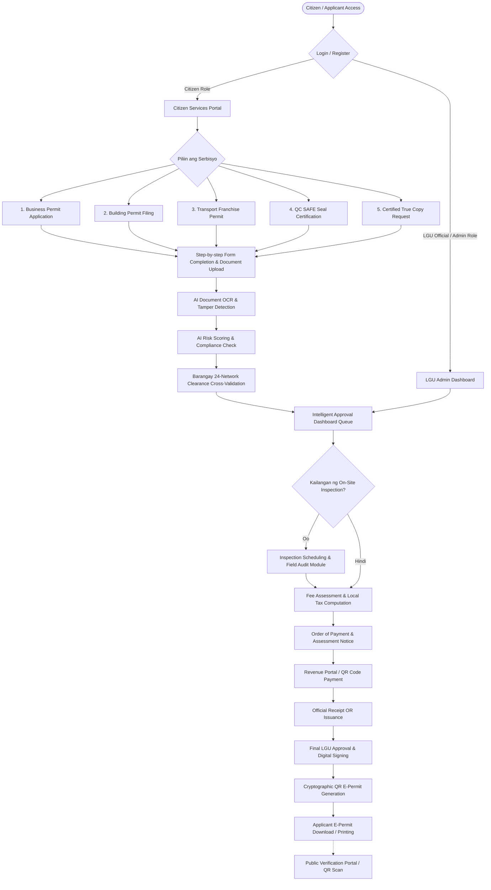
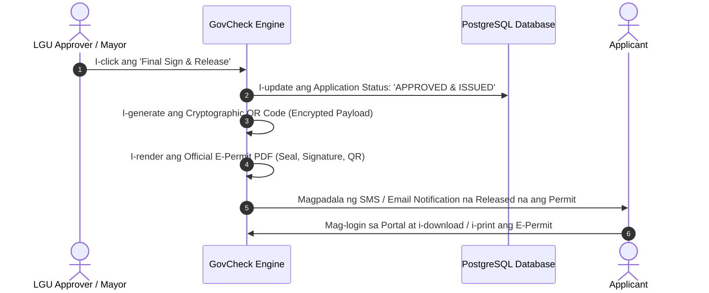

# GovCheck - Buong Step-by-Step System Process Documentation

Isang komprehensibong dokumentasyon na naglalaman ng bawat proseso at daloy ng **GovCheck** (LGU Business Permit & Licensing Management System) mula sa panig ng Citizen/Applicant, AI Automation Layer, hanggang sa LGU Back-Office Administration, Inspection, at Public Verification.

---

## 📑 Talaan ng Nilalaman
1. [Executive Overview & System Architecture](#1-executive-overview--system-architecture)
2. [End-to-End Master Workflow Diagram](#2-end-to-end-master-workflow-diagram)
3. [Proseso 1: User Onboarding & Authentication](#proseso-1-user-onboarding--authentication)
4. [Proseso 2: Business Permit Module (BPLO)](#proseso-2-business-permit-module-bplo)
   - [2.1 Bagong Aplikasyon (New Application)](#21-bagong-aplikasyon-new-application)
   - [2.2 Pag-renew ng Permiso (Renewal)](#22-pag-renew-ng-permiso-renewal)
   - [2.3 Pagbabago ng Impormasyon (Amendment)](#23-pagbabago-ng-impormasyon-amendment)
   - [2.4 Special Permit / Short-Term Permit](#24-special-permit--short-term-permit)
   - [2.5 Certified True Copies (CTC) Pulling](#25-certified-true-copies-ctc-pulling)
5. [Proseso 3: Building Permit & Blueprint Filing Module](#proseso-3-building-permit--blueprint-filing-module)
6. [Proseso 4: Franchise & Transport Permit Module](#proseso-4-franchise--transport-permit-module)
7. [Proseso 5: Barangay 24-Network Integration Module](#proseso-5-barangay-24-network-integration-module)
8. [Proseso 6: QC SAFE Seal Certification Module](#proseso-6-qc-safe-seal-certification-module)
9. [Proseso 7: AI & Automated Verification Layer](#proseso-7-ai--automated-verification-layer)
   - [7.1 AI Document OCR & Authenticity Verification](#71-ai-document-ocr--authenticity-verification)
   - [7.2 AI Compliance Checking & Risk Scoring](#72-ai-compliance-checking--risk-scoring)
10. [Proseso 8: LGU Back-Office & Assessment Workflow](#proseso-8-lgu-back-office--assessment-workflow)
    - [8.1 Intelligent Approval Dashboard](#81-intelligent-approval-dashboard)
    - [8.2 Inspection Scheduling & Field Audit](#82-inspection-scheduling--field-audit)
    - [8.3 Fee Assessment & Tax Computation](#83-fee-assessment--tax-computation)
11. [Proseso 9: Payment Gateway & Revenue Integration](#proseso-9-payment-gateway--revenue-integration)
12. [Proseso 10: E-Permit Generation, Cryptographic QR & Release](#proseso-10-e-permit-generation-cryptographic-qr--release)
13. [Proseso 11: Real-time Tracking & Public Verification Portal](#proseso-11-real-time-tracking--public-verification-portal)

---

## 1. Executive Overview & System Architecture

Ang **GovCheck** ay isang digital governance platform na binuo upang mapabilis, gawing transparent, at i-automate ang pagproseso ng mga business permits, building permits, transport franchises, at barangay clearances gamit ang mga sumusunod na core technologies:
* **Frontend:** React 18, TypeScript, Tailwind CSS, Lucide Icons, Vite
* **Backend:** Node.js, Express / RESTful API Architecture
* **Database Platform:** Eprovider Self-hosted Platform + PostgreSQL 16
* **Security & Auth:** Eprovider Auth (JWT, OTP, MFA, Trusted Device Fingerprinting)
* **Real-time Engine:** PostgreSQL `LISTEN` / `NOTIFY` Event Bus

---

## 2. End-to-End Master Workflow Diagram

---

## Proseso 1: User Onboarding & Authentication

### Hakbang 1.1: Pagbisita sa Public Landing Page
1. Binibisita ng publiko ang portal kung saan available ang mga pangunahing impormasyon, step-by-step guidelines, permit tracker, at instant QR verification.
2. Pindutin ang **"Get Started"** o **"Citizen Login"**.

### Hakbang 1.2: Pagpaparehistro / Pag-login (Eprovider Auth)
1. **Piliin ang Account Role:**
   - **Citizen / Business Owner:** Para sa mga nag-aaplay at nagmo-monitor ng permits.
   - **LGU Administrator / Assessor / Inspector:** Para sa mga kawani ng gobyerno.
2. **Authentication Security:**
   - Pagpasok ng Email at Password.
   - Pagsasagawa ng OTP (One-Time Password) o Multi-Factor Authentication (MFA) para sa secure transactions.
   - Pagpapatunay ng Trusted Device fingerprint.

---

## Proseso 2: Business Permit Module (BPLO)

Naglalaman ito ng limang (5) pangunahing sub-proseso para sa operasyon ng negosyo:

### 2.1 Bagong Aplikasyon (New Application)
Ginagamit para sa mga bagong itatayong negosyo sa lungsod o munisipyo.

* **Hakbang 1: Requirements Checklist**
  - Ipinapakita ang talaan ng mga kailangang dokumento (DTI/SEC/CDA Registration, Barangay Clearance, Proof of Right over Property gaya ng Lease Contract o Land Title, CTC, Sanitary/Fire Safety clearances).
* **Hakbang 2: Basic Documentary Requirements**
  - Pagbasa at pagsang-ayon sa mga legal na probisyon, data privacy act compliance, at terms of service.
* **Hakbang 3: Business Information and Registration**
  - Paglalagay ng DTI/SEC/CDA Registration Number, Date of Registration, TIN ng Negosyo, Tax Year, Legal Entity Type (Sole Proprietorship, Partnership, Corporation, Cooperative), at Business Trade Name.
* **Hakbang 4: Business Operation Details**
  - Exact Postal Address (Building/Unit No., Street, Barangay, Postal Code).
  - Business Contact Information (Email, Telepono, Mobile Number).
  - Sukat ng pwesto (Total Floor Area sa sq.m.), Bilang ng empleyado (Lokal at Residente), Lessor Details kung umuupa (Pangalan ng May-ari, Buwanang Upa).
* **Hakbang 5: Business Activity & Line of Business**
  - Pagpili ng PSIC (Philippine Standard Industrial Classification) Code.
  - Line of Business categorization (e.g., Retail, Food Service, Tech/IT, Manufacturing).
  - Initial Capital Investment (halaga ng puhunan).
* **Hakbang 6: Other Required Information**
  - Environmental compliance, Emergency Preparedness and Fire Safety info, Signage specifications.
* **Hakbang 7: Summary & Review Submission**
  - Buong pag-review sa lahat ng inilagay na detalye bago opisyal na isumite.
  - Pagka-submit, awtomatikong mag-iisyu ang system ng **Unique Application ID** (hal. `BP-2025-XXXXX`).

---

### 2.2 Pag-renew ng Permiso (Renewal)
Para sa mga umiiral na negosyo na kailangang mag-renew taon-taon tuwing Enero.

* **Hakbang 1: Input Existing Permit Details**
  - Ilalagay ang **Previous Business Permit Number** at **Previous Year's Official Receipt (OR) Number**.
* **Hakbang 2: Automated Data Pulling**
  - Awtomatikong kukunin ng system ang dating record ng negosyo mula sa database (Pangalan, Lokasyon, May-ari).
* **Hakbang 3: Gross Sales Declaration**
  - Ilalagay ang **Gross Sales / Receipts** para sa nakalipas na taon (batay sa ITR o Financial Statements).
* **Hakbang 4: Upload Renewal Proofs**
  - Pag-upload ng pinakabagong Barangay Clearance at Audited Financial Statement/ITR.
* **Hakbang 5: Summary & Compute Assessment**
  - Pag-kalkula ng bagong tax base at renewal assessment.

---

### 2.3 Pagbabago ng Impormasyon (Amendment)
Para sa mga negosyong may pagbabago sa kanilang operasyon.

* **Hakbang 1: Identifier Verification** – Ilagay ang umiiral na Business Permit Number.
* **Hakbang 2: Piliin ang Uri ng Amendment:**
  - *Change of Business Address / Transfer of Location*
  - *Change of Business Name / Trade Name*
  - *Additional / Deletion of Line of Business*
  - *Change of Management / Ownership Structure*
* **Hakbang 3: Paglalagay ng Bagong Detalye & Supporting Documents** – Pag-upload ng kaukulang board resolution o amended DTI/SEC certificate.
* **Hakbang 4: Submission & Queue for Re-evaluation**.

---

### 2.4 Special Permit / Short-Term Permit
Para sa mga pansamantalang aktibidad (Trade Fair, Bazaar, Seasonal Sale, Concert/Event, Promo).

* **Hakbang 1: General & Documentary Terms** – Pagsusuri sa guidelines ng special event permits.
* **Hakbang 2: Event Information** – Pangalan ng Event, Petsa ng Simula at Katapusan (Start and End Date), Eksaktong Venue/Lokasyon.
* **Hakbang 3: Organizer & Participating Entities Details** – Bilang ng booth o participating stalls.
* **Hakbang 4: Summary & Application Filing**.

---

### 2.5 Certified True Copies (CTC) Pulling
Para sa pagkuha ng opisyal at authenticated copy ng permit para sa bangko, bidding, o legal requirements.

* **Hakbang 1: Request Form Fill-up** – Ilagay ang Business Details, Requestor Info, at Reason for Request.
* **Hakbang 2: Data Privacy Confirmation** – Pagpapatunay ng awtorisasyon na kunin ang kopya ng dokumento.
* **Hakbang 3: Supporting Document Attachment** – Valid ID ng may-ari o Authorization Letter / SPA.
* **Hakbang 4: Certification Fee Payment Link** – Pagbabayad ng nominal certification fee.
* **Hakbang 5: Instant Download / Certified Digital Copy Release**.

---

## Proseso 3: Building Permit & Blueprint Filing Module

Ginagamit para sa mga bagong konstruksyon, renobasyon, o structural modifications.

1. **Step 1: Project Information Entry** – Deskripsyon ng gusali, uri ng occupancy (Residential, Commercial, Industrial), estimated project cost, at address ng lupa.
2. **Step 2: Blueprint & Plan Upload (Multi-Disciplinary):**
   - Architectural Plans
   - Structural Plans & Civil Engineering Computations
   - Electrical Blueprint & Load Computations
   - Sanitary & Plumbing Layout
   - Mechanical & Electronics Plans (kung applicable)
3. **Step 3: Document Metadata & Professional Seals** – Pag-encode ng PRC license numbers ng mga pumirmang Inhinyero at Arkitekto.
4. **Step 4: Automated Blueprint Analysis** – Pagsusuri ng system sa completeness at file resolution ng mga plano.
5. **Step 5: Endorsement to Engineering Office & BFP** – Awtomatikong pag-route ng application sa Office of the Building Official (OBO) at Bureau of Fire Protection (BFP).

---

## Proseso 4: Franchise & Transport Permit Module

Para sa mga pampublikong sasakyan (Tricycle operators, Jeepney/Modern PUV operators).

1. **Step 1: Operator & Driver Profiling** – Buong detalye ng operator at drayber, Driver's License No., contact number, at TODA/Transport Cooperative affiliation.
2. **Step 2: Vehicle / Unit Registration Details** – Engine Number, Chassis Number, Plate Number / MV File Number, Make and Model.
3. **Step 3: Route & Unit Inspection Audit:**
   - Pagtatalaga ng itinakdang ruta (Route Code at Coverage).
   - Pagkumpirma ng Roadworthiness, Fare Meter / Fare Matrix inspection, at Emission Compliance.
4. **Step 4: Submission & BPLO Transport Section Endorsement**.

---

## Proseso 5: Barangay 24-Network Integration Module

Inaalis ang manual na paglakad ng barangay clearance sa pamamagitan ng automated grid network.

1. **Step 1: Auto-detect Barangay** – Batay sa address ng negosyo, tinutukoy ng system kung aling barangay sa 24-barangay grid ang may sakop.
2. **Step 2: Inter-Barangay Clearance Lookup** – Awtomatikong nagtatanong ang system sa database ng Barangay kung may existing clearance o outstanding non-compliance ang aplikante.
3. **Step 3: Direct Clearance Attachment** – Kapag aprubado sa barangay level, awtomatikong nali-link ang digital barangay clearance sa Business Permit application nang walang delay.

---

## Proseso 6: QC SAFE Seal Certification Module

Isang sertipikasyon batay sa *QC SAFE (Stop All Forms of Exploitation) Seal Guidelines* para matiyak ang proteksyon at kaligtasan sa mga pampubliko at pribadong establisimyento.

1. **Step 1: Permit Number Validation** – Ilalagay ng user ang kanyang Business Permit Number.
2. **Step 2: Automatic Form Pre-filling** – Awtomatikong kinukuha ng system ang impormasyon ng establisimyento mula sa permit database.
3. **Step 3: Safety Compliance Self-Assessment Checklist:**
   - Anti-trafficking protocols at posters sa establisimyento.
   - Pagsasanay ng kawani sa pag-uulat ng kahina-hinalang aktibidad o pang-aabuso.
   - Emergency hotlines at focal person information.
4. **Step 4: Digital SAFE Seal Certificate Issuance** – Pagpapalabas ng opisyal na SAFE Seal badge at digital compliance record.

---

## Proseso 7: AI & Automated Verification Layer

Bago makarating sa mesa ng LGU evaluator, sumasailalim ang bawat aplikasyon sa automation:

### 7.1 AI Document OCR & Authenticity Verification
1. **Optical Character Recognition (OCR):** Binabasa ang text sa mga in-upload na ID, DTI certificates, Land Titles, at Fire Clearances.
2. **Tamper & Integrity Detection:** Sinusuri kung may digital tampering, font inconsistency, o pinalsipikang pirma/petsa.
3. **Data Matching Check:** Kinukumpara kung ang pangalan at address sa mga dokumento ay tugma sa inilagay sa application form.

### 7.2 AI Compliance Checking & Risk Scoring
1. **Risk Scoring Algorithm:** Sinusuri ang risk level (e.g. *96% Low Risk*, *High Risk due to Missing Fire Clearance*).
2. **Automated Flagging:** Naglalagay ng warning flags para sa mga kailangang bigyang-pansin ng LGU officer upang hindi maubos ang oras sa paghahanap ng error.

---

## Proseso 8: LGU Back-Office & Assessment Workflow

### 8.1 Intelligent Approval Dashboard
1. **Application Queue:** Nakalista ang lahat ng pending applications na nakaayos ayon sa priority at status (*For Evaluation, For Inspection, For Assessment, For Approval*).
2. **Side-by-Side Review Screen:** Ipinapakita ang inilagay na data, mga naka-attach na dokumento, at ang AI OCR/Risk summary report.
3. **Action Triggers:** Pwedeng piliin ng evaluator ang:
   - **Approve for Next Stage**
   - **Return for Correction (with specific feedback message)**
   - **Require Field Inspection**

### 8.2 Inspection Scheduling & Field Audit
1. **Automated Inspector Assignment:** Pagtatalaga ng field inspector mula sa Building, Health/Sanitation, o BPLO team.
2. **Schedule Calendar & Notification:** Pagpapadala ng SMS/Email alert sa may-ari ng negosyo ukol sa petsa at oras ng ocular inspection.
3. **Digital Inspection Checklist:** Paggamit ng inspector ng mobile/tablet audit checklist upang mag-upload ng actual field photos at findings.

### 8.3 Fee Assessment & Tax Computation
1. **LGU Local Tax Matrix:** Awtomatikong kinakalkula ang mga sumusunod batay sa local revenue code:
   - *Mayor's Permit Fee*
   - *Local Business Tax (LBT)* (batay sa Gross Sales o Capital Investment)
   - *Sanitary Inspection Fee*
   - *Building / Structural Inspection Fee*
   - *Garbage Service Fee*
   - *Zoning & Fire Inspection Clearance Fee*
2. **Tax Order of Payment (TOP):** Pag-isyu ng pinal na halagang dapat bayaran.

---

## Proseso 9: Payment Gateway & Revenue Integration

1. **Notification to Applicant:** Makakatanggap ang aplikante ng notification sa portal at email kasama ang electronic Order of Payment.
2. **Payment Channels:**
   - **Online Payment:** Integrasyon sa Revenue Portal, E-Wallets (GCash, Maya), Debit/Credit Cards, o Online Banking.
   - **Over-the-Counter / Reference QR:** Pag-generate ng QR code na pwedeng i-present sa LGU City Treasurer's Office o partner payment centers.
3. **Automated Official Receipt (OR) Issuance:** Pagka-kumpirma ng bayad, awtomatikong naitatala ang OR number, halaga, at timestamp sa system database.

---

## Proseso 10: E-Permit Generation, Cryptographic QR & Release

### Mga Nilalaman ng E-Permit:
* Official Republic of the Philippines at City/Municipal Government Seal.
* Pangalan ng May-ari at Business Trade Name.
* Permit Reference Number & Date of Validity (Hanggang Dec 31).
* Line of Business at Maximum Authorized Operating Units.
* Digital Signature ng Mayor at BPLO Chief.
* **Cryptographic Tamper-Proof QR Code**.

---

## Proseso 11: Real-time Tracking & Public Verification Portal

### 11.1 Real-Time Application Tracker
Maaaring i-type ng aplikante ang kanyang Application ID upang makita ang kasalukuyang estado:
* `[Step 1] Application Submitted` (Naisumite na)
* `[Step 2] AI & Document Review Passed` (Kumpleto ang mga papel)
* `[Step 3] Field Inspection Completed` (Pasado sa inspeksyon)
* `[Step 4] Payment Confirmed` (Bayad na ang buwis at fees)
* `[Step 5] Permit Issued & Ready for Download` (Aprubado at nailabas na)

### 11.2 Public Mayor's Permit Verification (Anti-Fixer & Anti-Fake)
1. **QR Code Scanning:** Kahit sinong mamamayan, pulis, o business inspector ay pwedeng i-scan ang QR code gamit ang anumang smartphone camera.
2. **Search by Reference Number:** Pwede ring ilagay ang Business Permit Number sa public verification webpage.
3. **Instant Verification Result:**
   - 🟢 **ACTIVE & VALID:** Ipinapakita ang opisyal na detalye ng negosyo, address, at expiration date.
   - 🔴 **EXPIRED / REVOKED:** May babala kung paso na ang permit o binawi dahil sa paglabag.
   - ⚠️ **INVALID / UNREGISTERED:** Babala laban sa mga pekeng lisensya o pekeng dokumento.

---

## 📌 Buod ng Benepisyo ng Daloy

| Aspekto | Tradisyunal na Sistema | GovCheck System Flow |
| :--- | :--- | :--- |
| **Oras ng Pag-apply** | 3 hanggang 15 araw | Ilang minuto online (24/7 accessible) |
| **Pila at Red Tape** | Maraming window at pabalik-balik | Single window, automated AI verification |
| **Barangay Clearance** | Pupunta pa sa Barangay Hall | Awtomatikong naka-link sa 24-Barangay Network |
| **Seguridad** | Madaling mapeke ang papel na permit | Cryptographic QR verification at real-time lookup |
| **Transaksyon sa Bayad** | Mahabang pila sa City Hall Cashier | Online Revenue Link at QR Code payment |

---
*Ang dokumentong ito ay nagsisilbing opisyal na technical at functional process reference para sa buong arkitektura ng GovCheck.*
