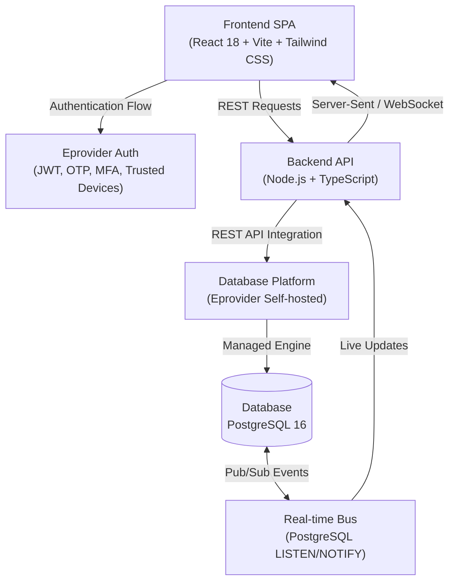

# GovCheck - Tech Stack Documentation

## Executive Overview
GovCheck is built as a high-performance, secure, and real-time business permit and licensing verification system. The system leverages a modern TypeScript-first architecture spanning across a React single-page application frontend, a Node.js API layer, and an enterprise self-hosted database platform powered by Eprovider and PostgreSQL 16.

---

## 1. System Architecture Diagram

---

## 2. Technology Stack Breakdown

### 🎨 Frontend Layer
* **Framework**: [React 18](https://react.dev/)
* **Build Tool & Bundler**: [Vite](https://vitejs.dev/)
* **Styling & Design System**: [Tailwind CSS](https://tailwindcss.com/)
* **Language**: TypeScript (`.tsx`)
* **Key Capabilities**:
  * Component-driven, responsive UI architecture.
  * Fast HMR (Hot Module Replacement) and optimized production chunking via Vite.
  * Utility-first styling with Tailwind CSS for high customizable aesthetics.

### ⚙️ Backend Layer
* **Runtime**: [Node.js](https://nodejs.org/)
* **Language**: TypeScript (`.ts`)
* **API Paradigm**: REST API (Integrated with Eprovider REST endpoints)
* **Key Capabilities**:
  * Strongly typed end-to-end schemas and interface contracts.
  * Modular controller and service architecture.
  * Secure middleware layer for auth token validation and request sanitization.

### 🗄️ Database Platform & Engine
* **Database Platform**: **Eprovider** *(Self-hosted PostgreSQL Platform)*
* **Database Engine**: **PostgreSQL 16**
* **Key Capabilities**:
  * Managed schema migrations, data replication, and connection pooling.
  * Native JSONB support, index optimizations, and audit logging.
  * Self-hosted deployment ensuring full data sovereignty and regulatory compliance.

### 🔐 Authentication & Security Framework
* **Auth Platform**: **Eprovider Auth**
* **Authentication Mechanisms**:
  * **JWT (JSON Web Tokens)**: Stateless access and refresh token management.
  * **OTP (One-Time Password)**: Email / SMS verification for sensitive operations.
  * **MFA (Multi-Factor Authentication)**: TOTP / Authenticator app support.
  * **Trusted Devices**: Fingerprinting and persistent device verification.

### ⚡ Real-Time Capabilities
* **Messaging Protocol**: **PostgreSQL `LISTEN`/`NOTIFY`**
* **Key Capabilities**:
  * Low-overhead pub/sub mechanism implemented directly within PostgreSQL.
  * Instant status change notifications for permits and license applications.
  * Zero external message broker dependency (e.g., Redis/RabbitMQ not required for event triggering).

---

## 3. Technology Summary Matrix

| Domain | Technology | Specification / Details |
| :--- | :--- | :--- |
| **Language** | TypeScript | Strict Mode Enabled across Frontend & Backend |
| **Frontend** | React 18 | Functional Components, Hooks, Context API |
| **Build Tool** | Vite | Lightning-fast dev server & ESBuildbundler |
| **UI Framework** | Tailwind CSS | Modern layout utility engine |
| **Backend Runtime** | Node.js | Asynchronous event-driven server runtime |
| **Database Engine** | PostgreSQL 16 | ACID compliant relational database |
| **Database Platform**| Eprovider | Self-hosted platform instance |
| **API** | Eprovider REST API | RESTful service endpoints |
| **Authentication** | Eprovider Auth | JWT + OTP + MFA + Trusted Devices |
| **Realtime** | Postgres LISTEN/NOTIFY | Direct database event broadcast system |

---

## 4. Operational & Security Considerations

1. **Type Safety**: Unified TypeScript definitions across API requests, database entities, and UI state models.
2. **Security**: Multi-layered authentication requiring MFA and device trust verification for high-privilege workflows.
3. **Efficiency**: Native PostgreSQL `LISTEN`/`NOTIFY` eliminates polling overhead for permit status updates.
